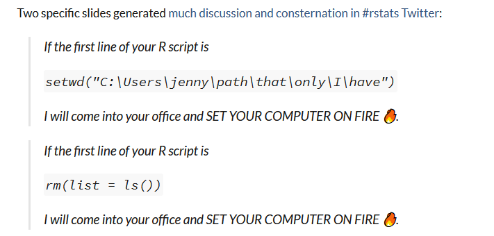
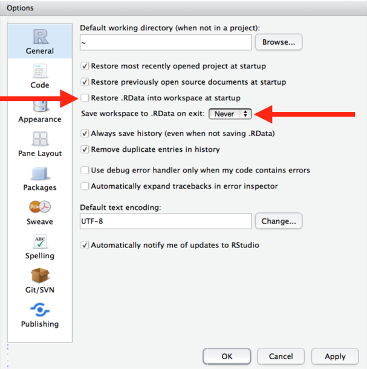
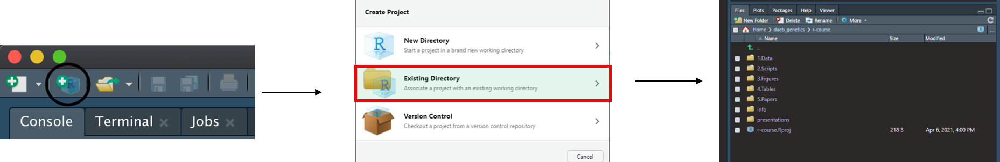
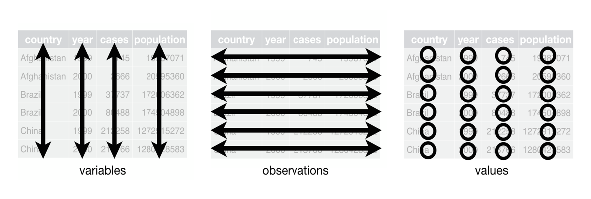
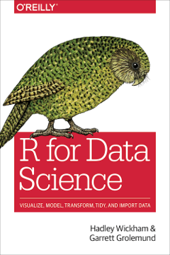
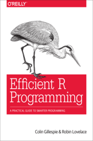
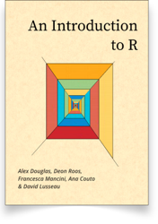

# Outline

This document contains a more detailed account of the presentations given for the Fish and Shelfish Department of the Greenland Institute of Natural Resources during June 2021. Each lecture can be visited directly by navigating through the left panel. The document also contains exercises some of which had been covered during presentations. Solutions are hidden initially and I suggest you try to resolve the exercise before checking it. Throughout the text you will see the code required to learn R, you are supposed to run these pieces in the console or, ideally, on your own script.

The objectives of the course are for the students to be comfortable when working with R; to learn to load, clean and manipulate data structures; perform exploratory analyses and produce informative graphs; and write reproducible code as well as setting a shareable working system.

All the packages you will use are under these lines. Remember to copy this to your console or script before starting to code. It is a good practice to have **all** the packages you are going to use at the beginning of the document, instead of loading them at different stages of your coding.

```{r setup, include=FALSE}
knitr::opts_chunk$set(echo = TRUE,
                      fig.pos = "H",
                      fig.width=8,
                      fig.height=6,
                      tab.pos = "H",
                      collapse = TRUE,
                      message = FALSE,
                      warning = FALSE,
                      eval = FALSE,
                      comment = "#>"
)                      

knitr::opts_chunk$set(echo = TRUE)

knitr::opts_knit$set(root.dir = rprojroot::find_rstudio_root_file())

options(knitr.kable.NA = "")
```

**Load packages into the environment**
```{r Libraries, eval=TRUE}

packages <- c("tidyverse", "reshape2", "readxl", "knitr", "RODBC")

installed_packages <- packages %in% rownames(installed.packages())
if (any(installed_packages == FALSE)) {
  install.packages(packages[!installed_packages])
}

invisible(lapply(packages, library, character.only = TRUE))
```

\newpage

# Lecture 1: Setting up R in your computer

## 1.1. What is R?

In the R project webpage you will find R defined as *A language and environment for statistical computing and graphics*. R can also be defined as a functional language in the sense that all sensible work is performed with functions. Even when you are making simple calculations like additions (+) or subtractions (-), R is performing a function: try in your console 2+2 and '+'(2,2), you will see that the result is the same but the second is the functional form and it is how R reads the command.

## 1.2. Why R?

People familiar with software like SPSS, minitab or Primer are used to perform the work by clicking on different tabs and filling information in GUI panels. Although easy and convenient, these programs are very limited in what they can do. In R all your work is perform by writing code and you can pretty much do whatever you want. Additionally:

* It is written by the experts on the field.
* It is free.
* It works in every operating system (Windows, Mac or Unix).
* It is open source, you can extract certain functions and modify them for your own goals.
* It is a jack of all trades: you can run statistics, make graphs, write papers, develop webs, etc.
* There is a whole community developing and using R, so whatever problem you are facing, someone have already solved and posted it.

## 1.3. Installing R and R Studio in windows

1. Go to the [R project webpage](https://www.r-project.org/). This is the main website for R and contains a good amount of information.
2. Click in the link “download R” under the section “Getting Started”.
3. Select your CRAN mirror- a mirror is a distribution site or server that you can access to download exact copies of the original hosting platform, these are created to keep the computational burden of downloading many times all around the world to a minimum. You will always want to pick the geographically closer mirror to minimize network load. For now, we will pick Denmark (although perhaps is more convenient to pick Iceland).
4. In the next window click in “Download R for Windows” and then “base”.
5. Download R 4.x.x for Windows, open the downloaded file and follow the instructions.

“RStudio is an integrated development environment (IDE) for R. It includes a console, syntax-highlighting editor that supports direct code execution, as well as tools for plotting, history, debugging and workspace management.” In general, I recommend you to work in Rstudio as this is a more holistic way to work in R than working only with the R console. In Rstudio you will have a view of your files, a history of plots that you have created with your code, console, script editor, etc. Moreover, convenient ways of working in R are available with Rstudio and we will cover these in the course.

To install it:

1. Go to the [Rstudio webpage](https://www.rstudio.com/). The Rstudio webpage has more resources available for R work and they are easier to obtain and understand than those in the R webpage. In Resources for example there are several links to blogs and free books for self-training and problem solving.
2. Click on DOWNLOAD located at the top of the webpage.
3. Select RStudio Desktop free for download.
4. On the next window click on the Download Rstudio for Windows button.
5. Open the downloaded file and follow the instructions.

Once you have both installed you can check out on the appearance of R studio (see below).


## 1.4. Keep R and R studio updated

R major releases do not occur constantly, some intermediate updates are released however to fix bugs etc. You may think that by updating R, some packages will be useless after, but this is often not the case: those packages that people use constantly will keep in line with major updates in R, otherwise, in R studio you can change the version of R to use on the goblal options. It is also important to update the packages themselves every now and then.

Updating R in windows is pretty straightforward using the package *installr*. In the R interface, paste the following code:

```{r updating}
# installing/loading the package:
if(!require(installr)) {
install.packages("installr"); require(installr)} #load / install+load installr
# using the package:
updateR() # this will start the updating process of your R installation.
```

Unfortunately, with the Comby system you will not have admin permissions to do so in your GINR laptop, but you can do it in your personal one.

You can update Rstudio from the same program going to Help -> Check for Updates, this will re-direct you to the Rstudio webpage to download and install the new version.
In Rstudio, you can also update packages by going to the Packages tab in the viewer pan and click Update; a list of available updates for your installed packages will appear and you can select which ones you want to install.

## 1.5. Installing packages

Packages are extensions of the functionality of R and contain new functions, data and help files. There are three sources for packages:

* CRAN
* Bioconductor (mainly bioinformatics)
* Github (specialized)

Usually, when installing packages and loading them into the library you will see this at the top of the scripts (or badly enough through the script):

```{r packages-wrong}
install.packages("package1", dependencies = TRUE)
install.packages("package2", dependencies = TRUE)
install.packages("package3", dependencies = TRUE)

library(package1)
library(package2) 
library(package3) 

```

If you have several packages, the top of your script will contain many lines with a reiterative structure which is not easy to correct if error appears. Instead, you can install and load your packages in one go like this:

```{r packages-right}
# Package names
packages <- c("package1", "package2", "package3")

# Installing packages if they are not installed
installed_packages <- packages %in% rownames(installed.packages())
if (any(installed_packages == FALSE)) {
  install.packages(packages[!installed_packages])
}

# Loading packages
invisible(lapply(packages, library, character.only = TRUE))

```

Realize that if you want to include new packages in your script, all you have to do is just writing the name of it in the package list (inside the c() function).

# Lecture 2: Setting a reproducible working system


## 2.1. Some good practices

There are some valuable considerations if you want to write valuable code that can persist in time and would not upset your peers and/or your future self. Here is a small list that yours truly sticks to his own heart:

* Save source (your code script) not the workplace. R processes (your session) are livestock not pets.
* Restart your R session often.
* Avoid using rm(list = ls()) and setwd(), more of that in a minute.
* Do not have all your work in a single code document
* Separate the functions you create in a "source" file which you can load on your scripts.
* Keep a consistent way for naming files, functions, objects, variables, arguments, etc.

**Remember that when naming objects, you should avoid names that are already assigned to functions.** For example "data" is a bad name as well as "data_frame" or "vector". For naming conventions I recommend you to take a look at [this](https://www.r-bloggers.com/2014/07/consistent-naming-conventions-in-r/). Additionally, you cannot start the name of your objects with either numbers or "."; You should also avoid using non-alphanumeric characters in your object names (i.e. &, ^, /, ! etc).

Concerning the rm(list = ls()) and setwd():



Why this? Well, whatever piece of work that start with these is definitely not reproducible, for starters. It may happen that you send me a piece of code to run or evaluate and I am superfocused on my own projects (with all my stuff created etc). So, I pay little attention to the code you sent me, I just run it to have a quick look and the rm(list = l()) removes everything I had created on my own work, moment when I will not very kindly think about your mom. Now, it is also wrong to just share the script and hopefully you will understand why in a few moments. Additionally, you may have the idea that rm(list = l()) will restart everything from scratch and you can start afresh... nah ah, clutter will persist around that may annoyingly cause you trouble. 

Finally, concerning setwd() will for sure not work in other computer so you will always have to change the path (which is an absolute path). Now, if you change the file somewhere else you will have to get the path again. Using absolute paths is quite a pain and if you have several paths in your code, whenever you move files you will have to change all these; you also have to know where exactly in your code is the path that has to be changed.

The solution for this is to set a **self-contained project oriented workflow**.

## 2.2. Project oriented workflow

As an starting exercise for the course, you will create a set of folders to contain a project.

1. In your Documents folder, or wherever you have your main projects, create a new folder. I leave you to choose the name, I called mine LearnR.

2. Inside this folder, create some sub-folders, you can explore some of the guidelines suggested by computing scientists in the internet. It is important that once you decide a way to organize your work you stick to it. Here is my suggestion:


3. Open Rstudio and go to Tools > Global options and uncheck the "Restore .RData into workspace at startup" and set the "Save workspace to .RData on exit" option to "Never".



4. Create an .Rproj. Go to File>New Project and click on Existing directory. Select your project folder. Now, if you navigate to your project folder you will see the .Rproj created there. This file sets the root of the project and whenever you want to work in your project you should open it.



What are the advantages of doing this?

* It allows you to work on different projects simultaneously as each is defined independently.
* All paths in your scripts are relative- think about this: It makes you avoid the mental exhaustion resulting from looking for files all over.
* Your working directory is settled where you have all the important bits.
* If you move your project directory to other computer, it will still work.

Last, when writing your code, make sure it is understandable. Populate it with comments, instructions and always give informative names to objects and functions (e.g. df1, df2, df3 are not good names, other than infering that they are data frames you cannot really see what the difference is between them).

# Lecture 3: Using R

## 3.1. Basic usage

In R language a number of points should be remembered:

* R is case sensitive. "Object" is different to "object" and R will give an error if not considering this.
* Anything that follows a # is a comment and will be ignored by R.
* R is ok with some spaces (in fact, please use them), except on operators.
* Decimal separator is the "."
* Use quotes to define characters.

Perhaps one of the most basic ideas is that R can be used as a calculator the size of your computer:

```{r calculator1}
2+2
log(1)
log10(1)
sqrt(4)
pi
4^2
```

R follows the usual mathematical convention of order of operations. Run these to see it:

```{r calculator2}
2 + 3 * 5 == 2 + (3 * 5)
2 + 3 * 5 == (2 + 3) * 5
2 + 3 * 5^2 == 2 + 3 * (5)^2
2 + 3 * 5^2 == 2 + (3 * 5)^2
```

Some arithmetics can be performed with functions within base R

```{r calculator3}
log(1)              # logarithm to base e
log10(1)            # logarithm to base 10
exp(1)              # natural antilog
sqrt(4)             # square root
```

But perhaps you want to have the results of your awesome and smart calculations and models stored somewhere so you can use them later, insert it in functions or create graphs with it. For this, we will cover a core concept of R: *objects*. Everything in R (including the last calculations) is an object. You can create these objects by making functions, generating vectors and data frames or making graphs among other things. When you store an object into the R environment, you are assigning a value or symbol to the said object and it will appear in your environment.

Consider the following:

```{r objects1}
my_vector <- c(rnorm(1:100)) # A vector of random values from a normal distribution
my_number <- 8 # A single value
my_chr <- "Ernest Shackleton" # A character value (in this case a name)
```

Here you see that 3 objects are created: a vector of normally distributed random values, a single numeric value and a character value (the legendary polar explorer). The operator to assign a "symbol" to a value, function, vector or whatever else is "<-". Each one of the last lines can be read as "symbol gets \{value, vector, character\}". I use "symbol" to refer to the name of the object.

Now, run these and take a look at your environment; you can see that the three objects are stored there with details describing them.

**<span style="color: red;">A useful trick is that you can quickly type "<-" typing "Alt" + "-".</span>**

## 3.2. Using functions

Most of the work done in R is performed by utilizing functions. Base R comes with a good amount of useful functions with which you can progress a great deal in your work. Nonetheless, various specialized or perhaps easier functions can be found in packages. Tidyverse represents an example of alternative functions to those in base R. Other packages are specialized to particular cases (for example, not long ago I found a package that allowed me to work with [tide periods](https://cran.r-project.org/web/packages/Tides/vignettes/Tides.pdf)).

All functions in R work in this way: function(argument1, argument2). For example, in read_csv(file = "path/to/file.csv", col_names = TRUE), I am calling the function with two arguments: file and col_names, in the first one I specify a path to a csv file for the function to read, in the second I am telling the function that the first row contains the names of the columns/variables. The arguments on the functions can either be compulsory for you to specify or can be called by default. Take a look at the function read_csv, just write in your console read_csv, you will see the actual function design; as you can see, some arguments have a default value (for col_names is TRUE, for col_types is NULL, etc); you can also see that this function builds on functions available on the package readr.

Let's take a look at some basic functions:

```{r functions}
punctuations <- c(6,5.6,8.4,7.1,9,4.9,10,6.9)
mean(punctuations)
var(punctuations)
sd(punctuations)
length(puntuations)
```

Can you say what each function is doing?

We will now take a look at some functions for creating vectors, run these into your console:

```{r creating-vectors}
my_seq <- 1:10
my_seq2 <- seq(from = 1, to = 5, by = 0.5)
my_seq3 <- rep(2, times = 10)
my_seq4 <- rep("abc", times = 3)
my_seq5 <- rep(1:5, times = 3)
my_seq6 <- rep(1:5, each = 3)
my_seq7 <- rep(c(3, 1, 10, 7), each = 3) # check that out, a nested function
```

What do each one of those do?

We can create a sequence vector just using ":" between two numbers, in which case the interval will be always one unit. We can also create a more "sofisticated" sequence by using the function seq() in which we can specify the span and the interval. We can create vectors of repeated values with rep, above you have all the different ways you can use this function.

## Exercises 1

1. You will commit a lot of mistakes, and you will keep committing them, the difference between being green as the fields of France or white as Gandalf´s tunic, is the time spent correcting mistakes or debugging. So, here are some lousy lines of code, correct them until they work correctly:

```{r exercises1}
sin(90 + 2*pi()) + Cos(0.3) - exp(0,5)
Moria_password <- "Mellon"; if (moria_password == "Mellon") print("The gates of Durin are opening") else ("I am going to open this damn gate with your head, Peregrin Tuk")
my_name <- Chuck Norris
```

2. Create a vector with 100 normally distributed values and calculate the mean, standard deviation and median.

**Solutions**:

```{r solutions1, class.source = 'fold-hide'}
#1. There are several possible options for line 1, some of the errors include the fact that pi is not a function, the sin functions is not closed and exp only accepts one value. In the second line see that Moria is written all with minors in the if loop so you have to change this. In the third line, you want to store a character but R cannot understand it as such unless is quoted.

sin(90 + 2*pi + Cos(0.3) - exp(5))
sin(90) + 2*pi + Cos(0.3) - exp(0)

moria_password <- "Mellon"
if (moria_password == "Mellon") 
  print("The gates of Durin are opening") else 
    ("I am going to open this damn gate with your head, Peregrin Tuk")

my_name <- "Chuck Norris"

#2.

norm_vector <- rnorm(100); mean(norm_vector); sd(norm_vector); median(norm_vector)
```

## 3.3. Working with vectors

Vectors are very useful objects where we can save data and use them in models. In exploring the different structures R can store our data, vectors are the most basic and behave similarly to vectors in linear algebra.

**Vectors in R can only be of one type**. These types include: numeric or double, integer, character, factor, logical and date-time (see [Data types]).

### Extracting elements from a vector

To extract (indexing or subscripting) one or more values (or elements) from a vector we use the square bracket notation.

```{r vector-indexing}

# Positional indexing

my_vector <- c(5,4,7,8,6,3,4,8,12,17,55,38)
my_vector[3] # Third element
my_vector[c(1,2,3,4)] #1st, 2nd, 3rd and 4th elements of the vector
my_vector[3:7] #Values from 3rd to 7th position

# Logical indexing

my_vector[my_vector > 4] # All elements greater than 4

# This works by satisfying the logical condition TRUE of:

my_vector > 4

# So R is actually doing this, checking in the condition on each element and returning only those which are TRUE

my_vector[c(TRUE, FALSE,  TRUE,  TRUE,  TRUE, FALSE, FALSE, TRUE,  TRUE,  TRUE,  TRUE,  TRUE)]

# Other logical operators include ==, <=, >=, != (equal to, less or equal than, greater or equal than, not equal to respectively)

# Additionally you can combine logical expressions with booleans. For example:

my_vector[my_vector > 6 & my_vector < 30]
my_vector[my_vector > 50 | my_vector < 10]

# The & symbol means AND, the | means OR
```

### Replacing elements on a vector

We can change the values of some elements in a vector using our [ ] notation in combination with the assignment operator <-. For example, to replace the 4th value of our my_vector object from 8 to 500.

```{r vector-replacing}
my_vector[4] <- 500 #Replacing one element
my_vector[c(1,3,2)] <- 100 #Replacing multiple element
my_vector[my_vector > 30] <- 10 #Replacing elements based on logical condition
```

### Ordering elements

In addition to extracting particular elements from a vector we can also order the values contained within. For this goal we can use the sort() function. By default, the function will order the vector from lower to greater, you can change this with the argument decreasing set to true. Alternatively you can also rev() the sort() function (this is nesting functions).

```{r vector-ordering}
sort_vector <- sort(my_vector)
sort_vector2 <- sort(my_vector, decreasing = TRUE)
sort_vector3 <- rev(sort(my_vector))
```

Another way of sorting values within a vector is by the values of another vector:

```{r vector-ordering2}
height <- c(180,170,190,150,210)
p_names <- c("Frederik", "Nils", "Sarah", "Proserpina", "Aqqaluk")

# 1st, we order the height vector

height_ord <- order(height) # The result of this are the positions of the vector organized by the value they contain in ascending order

# 2nd, we order the names according to the height

names_ord <- p_names[height_ord]
```

This is useful when sorting columns within a dataset. If you use just sort, each column will end up uncoupled.

### Vectorisation

Most R functions are vectorized. This means that the function will automatically operate on all elements of a vector. This works pretty much the same way as in linear algebra. Take a look at these examples:

```{r vectorisation}
vec1 <- c(2,5,6,3,4,7)
vec2 <- c(1,4,9,0,5,6)

# Multiplication by scalar
vec1*5

# Add vectors
vec1 + vec2

# Multiple vectors
vec1 * vec2

# These operations are made element by element
```

Be careful when using vectors of different size. R will recycle the elements in the shorter vector each time. Pay attention to this example:

```{r vectorisation2}
vec3 <- c(2,1)
vec1 + vec3 # 2+2, 5+1, 6+2, 3+1, 4+2, 7+1
```

### Missing data

In R, missing data is represented by NA (not available). Missing data is a natural occurrence in real data (or how I like to call it, data on the wild). Unfortunately, not all functions deal with missing data on the same way. If you are not careful, NAs can screw your work.

```{r missing-data1}
vec4 <- c(4,5,7.8,9,NA,4,2,1.8,4,4,5.3)
mean(vec4) # This will give NA as a result, luckily, mean is one of those functions with an easy argument to deal with missing data
mean(vec4, na.rm = TRUE) #na.rm (NA removal), but does not remove the NAs from the original object
```

## 3.4. Getting help

You can access help in mainly two ways:

* Accessing the help sheets: functions like ??read_csv, help("read_csv") or help(package = "ggplot") can give you access to the help sheets where functions are described covering the descriptions, the way to use it, the arguments it take, what is the reference of it and some examples on how to use it. And if you want to know more about getting help, why don't you try ?help.
* Forums you can find via Google. The blessing of open source programming is that everyone can get their hands on it and thus a community can be formed which one can access with prayers (do not worry, it's not like the church, you will get an answer) and requests. Perhaps the most famous of these forums is Stack Overflow. You can post a question in these forums and more often than not (if the question is well presented that is) you will get answers in a short time. If the question is not well formulated you can either get a kind soul asking you for more details or some idiot believing him/herself clever enough to ridicule you (and it is bloody nice when it backfires to them, sweet justice).

I recommend you to check out the [help section](https://intro2r.com/help.html#rhelp) of the book An Introduction to R.

## 3.5. Saving your work in R

Some of you may have read at some point some function like write_csv or similar which allow you to save dataframes (tibbles in this case) into a .csv file in your computer. This is one way of saving specific files in R and we all use them. Here however I am going to talk to you about the function save. With this function you can actually store more thatn one object in the same file. Let'scheck on one example (do not pay much attention to the code for creating objects, just so you know, below I am creating a data.frame, a list of data.frames and a numeric value).

```{r saving-objects}
VB_growth_DF <- data.frame("id" = 1:100, "weight" = c(runif(100, min = 0.30, max = 2)), "length" = c(runif(100, min = 25, max = 110)))
Mean_Lengt_Sps <- list(SBM = data.frame("year" = 2000:2011, "mean_length" = c(runif(12, min = 15, max = 60))),
                       RHP = data.frame("year" = 1998:2017, "mean_length" = c(runif(20, min = 25, max = 110))),
                       GDM = data.frame("year" = 1950:2011, "mean_length" = c(runif(62, min = 10, max = 100))))
b_param <- 10.20
save(VB_growth_DF, Mean_Lengt_Sps, b_param, file = "1_Data/out/VonBertModel.rda")
```

With the save function I stored the three objects into the file VonBertModel.rda (see that I have used a relative path because I am working within my project). I can use the function load() to get my objects into a new R session.

## Exercises 2

Create three vectors of the same length each (you decide how long): one must be names of kids, the second their weight and the third their height.

From these vectors get the shortest child, the tallest, the lightest and the heaviest; remember the function order so you know which kids are each.

Using the weight and height vectors, calculate the bmi and store it as thus [bmi = (weight/height^2)*10000]

Create a dataframe called kids or children containing the 4 vectors (you can recycle part of the code I used previously)
Save it all (the dataframe and the vectors) as a .rda file and then check with load that it did it properly.

**Solutions**:

```{r solutions2, class.source = 'fold-hide'}
kid_names <- c("Roi", "Breogán", "Diego", "Laura", "Mónica", "Sara")
kid_weights <- c(31, 43, 35, 28, 26, 30)
kid_heights <- c(110, 113, 109, 104, 107, 105)

kid_names[order(kid_heights)] # Laura is the shortest and Breogán is the tallest
kid_names[order(kid_weights)] # Mónica is the lightest and Breogán is the heaviest

kids_bmi <- (kid_weights/kid_heights^2)*10000

kids <- data.frame(name = kid_names, 
		               height = kid_heights,
		               weight = kid_weights,
		               bmi = kids_bmi)

save(kid_names, kid_weights, kid_heights, kids_bmi, kids, "1_Data/out/children.rda")
load("1_Data/out/children.rda")
```

# Lecture 4: Data structures in R

## 4.1. Data types

A colleague sent you two vectors containing the mean length of two fish species which occupy the same ecological niche and are considered sister species, across 7 locations in East Greenland. Literature tells you that they have very similar ontogenies (note that this is just an example) and compete for the same resources. You want to make some quick comparison of these lengths to check whether one species is presumably doing better than the other depending on location.

```{r chunk1, eval=TRUE}
load("1_Data/out/sebastes_meanLengths_East.rda")
```

```{r chunk2, eval=FALSE}
comparison <- Sebastes1 - Sebastes2
```

But when you run it in your console it gives an error. It should not be the case as both vectors contain numbers, however when you check your environment, or inquire R about it:

```{r chunk3, eval=TRUE}
is.numeric(Sebastes1)
is.numeric(Sebastes1)
```

Neither of them are numeric (the function is.numeric() is a logical evaluation, it is the equivalent of asking: is it numeric?), for some reason your colleague passed you these vectors as character type. You can coerce these vectors into numeric and be able to make the comparison.

```{r chunk4, eval=TRUE}
Sebastes1 <- as.numeric(Sebastes1) ; Sebastes2 <- as.numeric(Sebastes2)
comparison <- Sebastes1 - Sebastes2
print(comparison)
```

Many errors in R are the result of applying functions on inadequate data types. Previously, we mentioned the different data types that R uses (numeric, double, integer, logical, character, factor, date-time). Matrices and vectors will only contain one type while data frames, tibbles and lists will contain several. To work with certain data types there even exist whole packages, (date-time: [lubridate](https://lubridate.tidyverse.org/); factors: [forcats](https://forcats.tidyverse.org/)).

In several instances you will have the chance to coerce a certain data type into another. For example, check the following plot:

```{r echo=FALSE, eval=TRUE}
foo <- read_csv("1_Data/raw/DummyDF.csv")
ggplot(foo, aes(x = length, y = weight, color = species)) +
  geom_point(size = 5) +
  ylab("Weight (kg)") +
  xlab("Length (cm)")
```

Notice that the legend for the "species" category is given as a gradient of blue colors, but you know that (in spite of the hot debate in evolution about the term "species") these should be discrete categories. The code for that particular graph, once the data had been loaded (foo), is:

```{r}
ggplot(foo, aes(x = length, y = weight, color = species)) +
  geom_point(size = 5) +
  ylab("Weight (kg)") +
  xlab("Length (cm)")
```

Now, in the actual data, the species column is given in numbers (1,2 and 3) and numeric categories are taken as continuous by default. In order to correct this and produce this graph:

```{r echo=FALSE, eval=TRUE}
ggplot(foo, aes(x = length, y = weight, color = as.factor(species))) +
  geom_point(size = 5) +
  ylab("Weight (kg)") +
  xlab("Length (cm)") +
  scale_color_discrete(name = "Species")
```

You will have to coerce the species variable as factor:

```{r}
ggplot(foo, aes(x = length, y = weight, color = as.factor(species))) +
  geom_point(size = 5) +
  ylab("Weight (kg)") +
  xlab("Length (cm)") +
  scale_color_discrete(name = "Species")
```

There are several coercing functions and all of them have the same aspect, that is as.{data-type}(vector or column).

## 4.2. Data structures

At this point you should be fairly familiar with what a vector is. Although these are useful, most of the time you will receive your data in way more complex formats and with more than one dimension. Such structures include matrices, arrays, lists and data frames.

### Matrices and arrays

Matrices are bi-dimensional rectangular arrangements of a single vector while arrays are multidimensional vectors. Matrices and arrays tend to be the war horse when performing ecological modeling, perhaps because they can store complex data in quite a simple way.

Below you will learn to use functions that allows you to create and modify matrices and arrays.

To create matrices you can use matrix() and for arrays, array(). The following matrix:

$$X = \begin{bmatrix}1 & 2 & 3\\
4 & 5 & 6\\
7 & 8 & 9
\end{bmatrix}$$

Can be created in R as:
```{r creating-matrices, eval=TRUE}
X <- matrix(1:9, ncol = 3, byrow = TRUE)
X
```

We will use this basic matrix to play around, so let us take the red pill (yes, puns will go on). Let's first check the dimensions of it; in R you make this with the function dim(), specifying the object, in this case your matrix X (this function is simple as that, only has one argument). The function dim() will tell you the number of rows first and the columns second. You can change the rows and column names with rownames() and colnames() respectively (you can also use these for data frames). For our matrix, we can do:

```{r modifyin-matrices1}
colnames(X) <- c("Red", "Green", "Blue")
rownames(X) <- c("White", "Black", "Yellow")
```

Make sure that whenever naming columns or rows **you do not use spaces**. Remember the naming conventions that was linked [here](https://www.r-bloggers.com/2014/07/consistent-naming-conventions-in-r/).

Performing calculus with matrices is quite straightforward in R. You can perform element by element operations with a single number (scalar).

```{r eval=TRUE}
X*2
X+2
X/2
X-2
X^2
```

You can also operate by vectors but always remember that these are perform column by column. The first operation is performed with a vector of the same length as the matrix. In the second, the vector is recycled each time.

```{r, eval=TRUE}
X - 1:9
X - c(1:3)
```

Operations can be performed between matrices as long as they have the same dimensions.

```{r eval=TRUE}
# Subtraction
X - matrix(9:1, ncol = 3, byrow = TRUE)
# Multiplications
X * matrix(9:1, ncol = 3, byrow = TRUE)
# Matrix multiplication
X %*% matrix(9:1, ncol = 3, byrow = TRUE)
```

You can also transpose and extract the diagonal using the functions t() and diag() respectively.

```{r eval=TRUE}
t(X)
diag(X)
```

Concerning arrays, you can consider them as a list of matrices and pretty much all of the above will work the same way.

```{r arrays, eval=TRUE}

#Creating arrays:
# BY splitting a vector in n matrices (in this case 2)
R_array <- array(1:18, dim = c(3,3,2))

# By combining two matrices
R_array2 <- array(data = c(X, matrix(9:1, ncol = 3, byrow = TRUE)), dim = c(3,3,2))

# Change names
colnames(R_array) <- c("Red", "Green", "Blue")
rownames(R_array) <- c("White", "Black", "Yellow")

# You can use the square bracket notation to extract one matrix of the array:
X2 <- R_array[,,2]
```

### Lists

Lists are powerful data structures that can contain all kind of data types and even data structures themselves, yep, that's right, lists can contain lists. We can create a list ourselves out of different objects we have created over our code. For example:

```{r lists, eval=TRUE}
# A data frame
VB_growth_DF <- data.frame("id" = 1:100, "weight" = c(runif(100, min = 0.30, max = 2)), "length" = c(runif(100, min = 25, max = 110)))
# A list of data frames
Mean_Lengt_Sps <- list(SBM = data.frame("year" = 2000:2011, "mean_length" = c(runif(12, min = 15, max = 60))),
                       RHP = data.frame("year" = 1998:2017, "mean_length" = c(runif(20, min = 25, max = 110))),
                       GDM = data.frame("year" = 1950:2011, "mean_length" = c(runif(62, min = 10, max = 100))))
# A scalar or parameter
b_param <- 10.20

# The list
my_list <- list(VB_growth_DF, Mean_Lengt_Sps, b_param)
```

Run this in your R and take a moment to explore the list. You will notice that each element has been assigned a number as name (1,2 and 3). You can specify names in the list function like:

```{r lists2}
my_list <- list("VB_growth_DF" = VB_growth_DF, "Mean_Lengt_Sps" = Mean_Lengt_Sps, "b_param" = b_param)
```

One interesting application of lists is that you can store several data frames with the same structure but for different locations, species, patients, experiments, etc; and run the same analysis through each list element obtaining results for each one, of course, you could do the same by just binding the data frames and adding a new variable (that is location, species, patients, etc), but it may be quite tricky, specially (as I will show below) when making loops. Let's show this with a simple example using the list of data frames we produced. I am going to produce one graph for each element by performing an iteration or loop:

```{r working lists, eval=TRUE}

lapply(Mean_Lengt_Sps, function(df) { ggplot(data = df, aes(x = year, y = mean_length)) + 
                                                 geom_point(size = 3) +
                                                 xlab("Year") + ylab("Mean Length")})
# You can store this in a list which will contain a graph for each element of the list Mean_Lengt_Sps.
```

This has iterated through the list and produced a graph with x = Year and y = Mean Length for each element. We are not going to go into detail into the apply family of functions or looping for that matter, but you can check the [chapter on iteration in the R for Data Science book](https://r4ds.had.co.nz/iteration.html). Rather, I wanted to demonstrate the ease of usage (those are not an extremely large number of code lines) and the convenience of using lists at some points. Also, if you do check the graphs, this is for the sake of example, I know the third graph can very easily make you frown.

To access list elements you can use the $ symbol or the [[]] function. In some special objects which behave as a list you could also access different elements by using the slot @.

### Data frames

By far the most used kind of structure. You can think of it as an assembly of vectors of various data types organized in columns. Rows in a data frame are observations and columns are variables. Data frames are rectangular (all columns must have the same number of observations) and missing values must be stored as NA. This is the aspect of a tidy data frame:


 
You can create a data frame with the function data.frame() in various ways. You can create a set of different vectors and call them inside the function; you can also "coerce" a matrix into a data frame; most often you will import the data from somewhere else and we will cover that on the next section.

There are a number of "inspection" functions you can use to take a quick glance at your data frame such as summary(), str(), glimpse(), dim(), head() or tail(). Try them to see what each of them do.

## 4.3. Importing data

### Previous notes on data entry

Before we get ourselves into the fray of importing, tidying up and wrangling our data (central to any research project), it is important to pass certain message on how to actually capture data. R will help you a lot into dealing with messy and untidy data, however, sometimes in order to do so  you will require certain levels of knowledge that may be tricky to master (for example the use of regular expressions when finding and replacing patterns). Thus, the person in charge of collecting data should be aware of the difficulties. There are a number of points to this respect that we all should respect (some we may have covered already, but it's worth repeating them):

* Store data as flat files in open data format. Refer to the previous Figure, where the first row includes the variable/column names and no internal hierarchy is observed (neither rows nor columns are nested).

* Organize data in a tidy format with unique records in rows, not columns. This “tidy data” format means that each variable is saved in its own column and each observation is saved in its own row.

* Add a README file within the same location as your data detailing the characteristics of each variable included in the data. Additionally, you should also include comments here. **It is a very lousy practice to include comments as a variable in your data frame**.

* Be systematic when naming files, variables and assigning factor values (I am quite tired myself of the tons of different ways that you can find sex recorded in data for instance; other examples include names with different capitalization- John and john, etc).

* Do not use special characters. This may annoy you, but that is how things are- do not use danish special letters like "æ" or "ø". You will not see me writing [our special letter](https://da.wikipedia.org/wiki/%C3%91), but rather nh as they do in Portugal. So, if I can renounce it for the sake of practicality, you can too.

* Do not mix text and numbers in the columns unless to specify a particular code (something like XZCR45800).

* Your raw data may be a tremendous nightmare where all the above has been sent to utter obliteration, however, you should **NEVER** make corrections on top of the original file and saving it each time (creating an unending number of versions). Instead, try to generate a separate file where you can modify at will.

* Be consistent with blank cells by using NA.

* Do not store your data in XLS or XLSX, use .txt or .csv.

And just for you to know, besides my own educations and experience, all the previous points I took from [here](https://sfg-ucsb.github.io/fishery-manageR/data-entry-management.html), that's it, your own field of expertise; so please, oblige!!

### Functions for importing data

Most often, you would have included all your recorded raw data into an excel sheet. There are of course other raw formats that R can take in (special formats produced by particular machinery or software) but we all use some form of spreadsheet as this is human friendly enough.

So, let's assume you have included all your data into some form of sheet after the last survey. Your data may likely be in .csv, .txt or .tsv format. Some of you may be familiar with read.table, but if you write "read." in the console, R will provide a number of suggestions to complete the function, and as you can see there are quite a few. These are your options in base R. On your console, run the following (the data is contained in the folder 1_Data that I provide with the course):

```{r baseR-import}
squid_txt <- read.table(file = "1_Data/raw/squid1.txt", header = TRUE, sep = "\t", stringsAsFactors = TRUE)
squid_csv <- read.csv(file = "1_Data/raw/squid1.csv", header = TRUE, sep = ",", stringsAsFactors = TRUE) # Ugh, you have that ï.. at the beginning? then add the argument fileEncoding="UTF-8-BOM"
squid_xls <- readxl::read_xlsx(path = "1_Data/raw/squid1.xlsx", col_names = TRUE)
```

All the above have similar "grammar", perhaps the most different is the last, which reads straight away from the excel. We will cover more later, for now, take a look on how the functions are written. The first argument, file, indicates the path where the file your data is stored in is located and always goes quoted ""; the next argument takes on logical values, TRUE or FALSE (FALSE by default in read.table()) and indicate whether the first row contains the names of your variables; the argument sep takes on special quoted values- in the first example a tabulation and in the second (obviously since .csv = comma-separated-values) a comma, but it can also take "|" or ";" depending on how your variables are separated; the stringAsFactors argument tells the function whether to consider character variables as factors, the default in last versions is FALSE, if you want to understand a bit about this particular argument read [this](https://simplystatistics.org/2015/07/24/stringsasfactors-an-unauthorized-biography/).

An alternative to these base R functions are the ones within the [readr package](https://readr.tidyverse.org/), within tidyverse. There are a number of advantages of these functions vs base R:

* These are faster to run functions (this gets to be important when your dataset is really big) and they even have a progress bar. After completion, it has the detail of telling you how each variable has been parsed.
* They do not produce data.frames but tibbles. These functions have never transformed strings to factors, they leave column names untouched and do not produce row names.
* They are more reproducible as base R functions inherit some behaviour from your system.

```{r readr-import}
squid_txt <- read_delim(file = "1_Data/raw/squid1.txt", col_names = TRUE, delim = "\t")
squid_csv <- read_csv(file = "1_Data/raw/squid1.csv", col_names = TRUE)
```

Concerning whether to read straight from an excel or other software, you should usually avoid this, but there may be times it would be faster to do so. For this goal you can use the package foreign which allows you to import data from Minitab, SPSS, Stata and SAS.

## 4.4. Wrangling data frames

For this section we are going to use a dataset of our own. **<span style="color: red;">Note that this are data obtained from the Fisheries Department and will only be available during the time we cover this section. For those who want to do the course on their own, the dataset would be available on demand.</span>**

Instead of base R, we will using the tidyverse packages [readr](https://readr.tidyverse.org/), [dplyr](https://dplyr.tidyverse.org/) and [tidyr](https://tidyr.tidyverse.org/). Let's load the data first:

```{r load-GRHA, eval=TRUE}
catches_1997_2019 <- read_csv("1_Data/raw/D_FISH_ANT.RHG.RNG97-2019.csv", col_names = TRUE)
```

We have loaded the data we called catches_1997_2019 using read_csv. In the console you can see how the function has parsed the different variables: we have three character variables (ship, code and species) and the rest are numeric (here called double; check [here](http://uc-r.github.io/integer_double/) to understand the difference between double and numeric/integer; no need to dwell on it though). We can inspect the data with str() (or the dply equivalent glimpse()) and/or summary(). With summary you can get some basic stats like mean, median, maximum and minimum (for numeric variables that is).

```{r echo=FALSE, eval=TRUE}
summary(catches_1997_2019)
```

Do you notice something wrong? The data has a particular flaw, the "response" variables, the ones will mostly fill the y axis of you graphs or be dependent in your statistic models, are named after their measurement units. The obvious question is kg of what, numbers of what? In this case, "kg" refers to a catch and "num" the number of fishes of a species whose total weight = kg. Let's rename these variables, remember that for a change to be effective in your data object you need to reassign it:

```{r}
catches_1997_2019 <- rename(catches_1997_2019, catch_weight = kg, fish_amount = num)
```

Realize that you may understand the data as it is because you have attended the surveys, otherwise many details will be subject to interpretation, and this is a no go. The difference is that if the num variable (now fish_amount) is not understood right, those values that are not integers can be observed as normal, but, if we understand that the num variable is an amount of individuals, these values will make us, by the very least, skeptical since a few of them are not integer pointing to some kind of counting error. Additionally, remember that for understanding the data there should be a README file somewhere detailing how the data was gathered and what are the different variables. A quite famous dataset used in R is the mpg object, ideally your README file should look something like what is displayed when you type ?mpg in your console.

Each variable on our dataset can be accessed using the "$" symbol. You can extract each variable as a vector and use it independently, otherwise, you can use functions without the need of extracting it.

```{r, eval=TRUE}
catches_kg <- catches_1997_2019$catch_weight
mean(catches_kg, na.rm = TRUE)

# Better still

mean(catches_1997_2019$catch_weight, na.rm = TRUE)
```

### Subsetting

The functions filter and select inside the dplyr package are the equivalent to use the [] indexing. Consider the following:

```{r}
catches_1997_2019["catch_weight"] # or
catches_1997_2019[, 7]

select(catches_1997_2019, catch_weight)
```

We can select specific columns by their name (specified as quoted character) or position (in this case 7th column) when using square brackets. In dplyr we can do this with the select() function. You can of course select multiple columns with either base R or tidyverse.

```{r}
# With base R
catches_1997_2019[, 2:5]
catches_1997_2019[, c(2,4,7,8)]
catches_1997_2019[, -c(1,2,3)]

# With select
select(catches_1997_2019, species:fish_amount) # Using sequence ":"
select(catches_1997_2019, year, species, catch_weight) # Selecting specific columns
select(catches_1997_2019, -code, -ship) # Dropping columns
```

In base R is fairly 

# Lecture 5: Graphics and linear models

# Resources

Much of the information covered here (as well as some images and figures) come from the book An Introduction to R.

[{width=155}](https://r4ds.had.co.nz/)
[](https://csgillespie.github.io/efficientR/)
[{height=240}](https://intro2r.com/)
[](https://rpubs.com/)
[](https://blog.rstudio.com/)
[](https://www.data-to-viz.com/)
[](https://stat545.com/)
[](https://stackoverflow.com/)